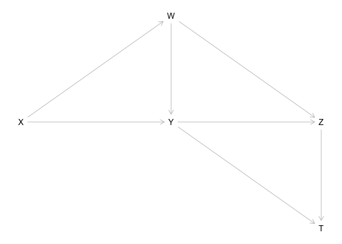

Primer on Daggity
================

## Primer

Exercises from “Causal Inference in Statistics: A Primer” by Pearl,
Glymour, and Jewell.

``` r
library(dagitty)
library(lavaan)
```

    ## This is lavaan 0.6-9
    ## lavaan is FREE software! Please report any bugs.

## Preliminaries

### Study question 1.4.1

We first define the graph in this exercise using dagitty syntax and plot
it. You can also embed plots, for example:

``` r
g <- dagitty('dag {
    X [pos="0,1"]
    Y [pos="1,1"]
    Z [pos="2,1"]
    W [pos="1,0"]
    T [pos="2,2"]
    
    X -> Y -> Z -> T
    X -> W -> Y -> T
    W -> Z
}')
plot(g)
```

<!-- -->

1.  Name all of the parents of *Z*.

``` r
parents( g, "Z" )
```

    ## [1] "W" "Y"

2.  Name all of the ancestors of *Z*.

``` r
ancestors( g, "Z" )
```

    ## [1] "Z" "Y" "X" "W"

3.  Name all of the children of *W*.

``` r
children( g, "W" )
```

    ## [1] "Y" "Z"

4.  Name all of the descendants of *W*.

``` r
descendants( g, "W" )
```

    ## [1] "W" "Z" "T" "Y"

5.  Draw all simple paths between *X* and *T*.

``` r
paths( g, "X", "T" )$paths
```

    ## [1] "X -> W -> Y -> T"      "X -> W -> Y -> Z -> T" "X -> W -> Z -> T"     
    ## [4] "X -> W -> Z <- Y -> T" "X -> Y -> T"           "X -> Y -> Z -> T"     
    ## [7] "X -> Y <- W -> Z -> T"

6.  Draw all the directed paths between *X* and *T*.

``` r
paths( g, "X", "T", directed=TRUE )$paths
```

    ## [1] "X -> W -> Y -> T"      "X -> W -> Y -> Z -> T" "X -> W -> Z -> T"     
    ## [4] "X -> Y -> T"           "X -> Y -> Z -> T"
